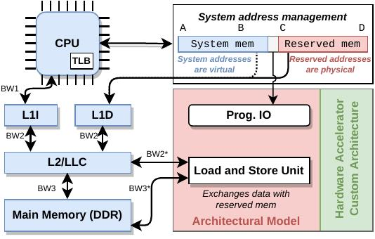

# gem5-accel

gem5-accel is a framework built on top of gem5 targeting the fast modeling, validation, and evaluation of novel heterogeneous hardware accelerator architectures before actually implementing them in RTL. To achieve this, three sets of tools are provided:
* An [architectural model](#architectural-model) consisting of a boilerplate that automatically takes care of integration with the CPU and the memory hierarchy, as well as data management.
* [Simulation scripts](#simulation-scripts) targeting both SE and FS mode, exemplifying how to set up an accelerator-enabled processing system that can be simulated by gem5. In addition, a (template) Linux driver is also provided to enable control of the hardware accelerators from the OS when FS mode is used.
* Finally, an example [host code](#host-code) is also provided to show how to interact and control the hardware accelerator from the host side. This example is compatible both with the SE mode (directly) and the FS mode (through the provided device driver).

## Architectural model

The architectural model of gem5-accel is illustrated below. As it can be observed, three main architectural blocks are provided to help in the modeling of novel hardware accelerators: (1) System address management; (2) Prog. IO; and (3) Load/Store Unit.



The System address management block is responsible for managing a shared memory region that can be accessed by the CPU and the hardware accelerator. The hardware accelerator reads the operands and stores the results within this region.

The Prog. IO block implements a bank of programming registers that can be used by the CPU to control the hardware accelerator.

Finally, the Load and Store Unit is responsible for mediating all data transfers between the hardware accelerator and the memory hierarchy, automatically implementing and concealing all the complex control required for that effect.

The architectural model can be found [here](src/ndp), and a practical example of an hardware accelerator based on the provided architectural model is [here](src/gemmini_dev_a). 

## Simulation scripts

Examples of both SE and FS simulation scripts can be found [here](configs/ndp) and [here](configs/gemmini).

## Host code

An example illustrating how to communicate with the hardware accelerator from the host code can be found [here](tests/test-progs/gemmini-apps), and [here](tests/test-progs/ndp/ndp_dev_a/driver) an example of a device driver to be used with FS mode can be found.

## FS kernels and images

The authors rely on the images and kernels officially supported by gem5, available at https://resources.gem5.org/.

## How to cite

```
@inproceedings{DBLP:conf/sbac-pad/VieiraR0T22,
  author       = {Jo{\~{a}}o Vieira and
                  Nuno Roma and
                  Gabriel Falc{\~{a}}o and
                  Pedro Tom{\'{a}}s},
  title        = {gem5-ndp: Near-Data Processing Architecture Simulation From Low Level Caches to {DRAM}},
  booktitle    = {{SBAC-PAD}},
  pages        = {41--50},
  publisher    = {{IEEE}},
  year         = {2022}
}
```
